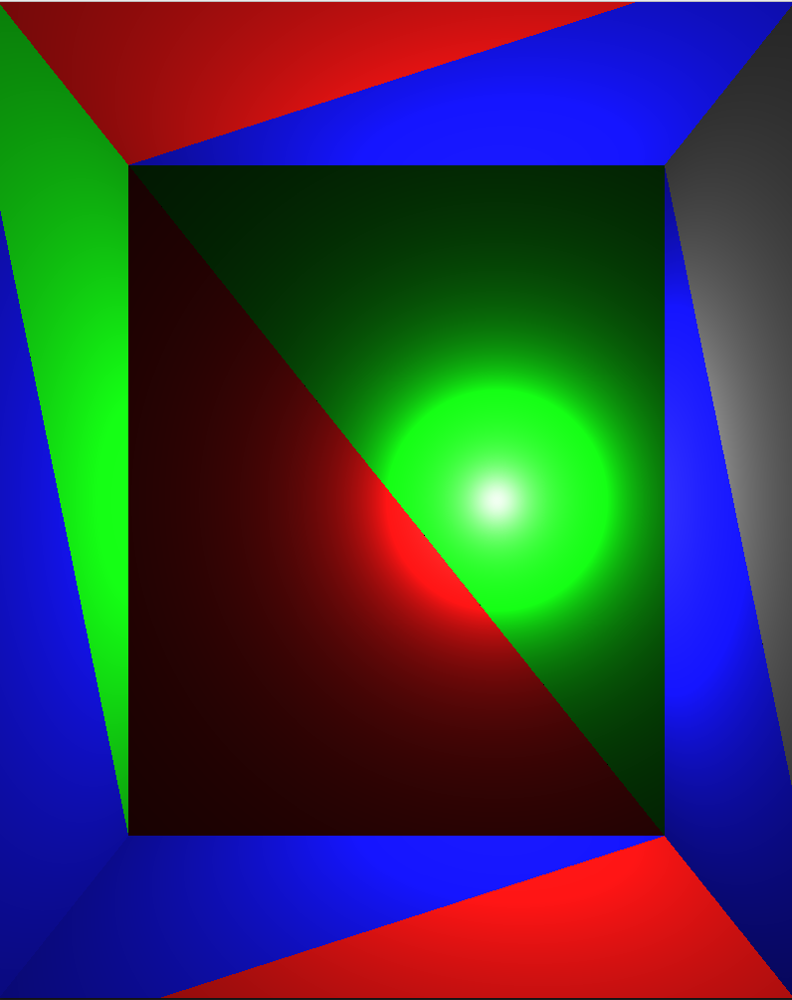
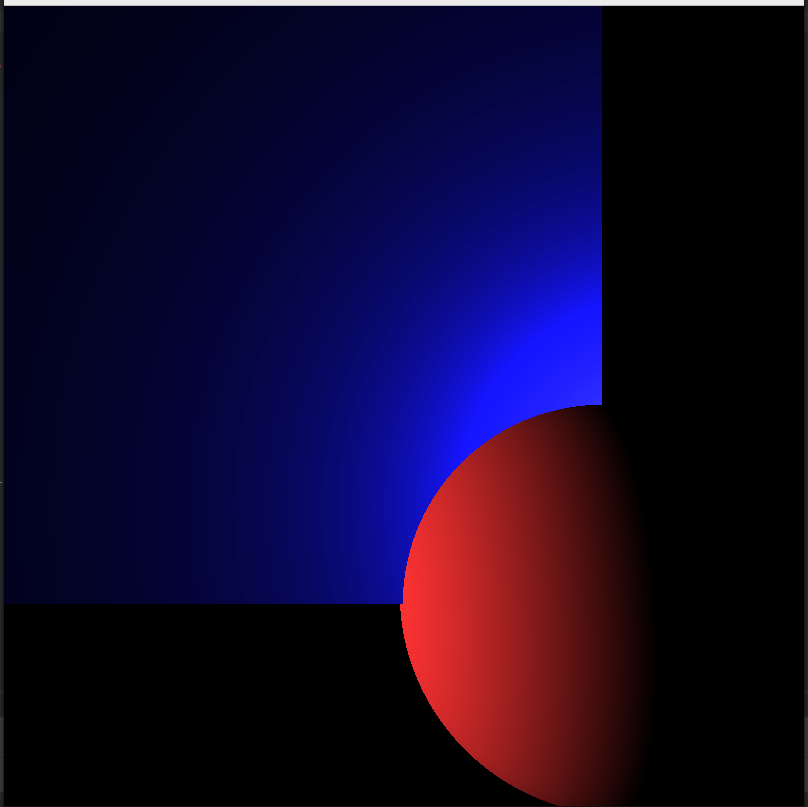
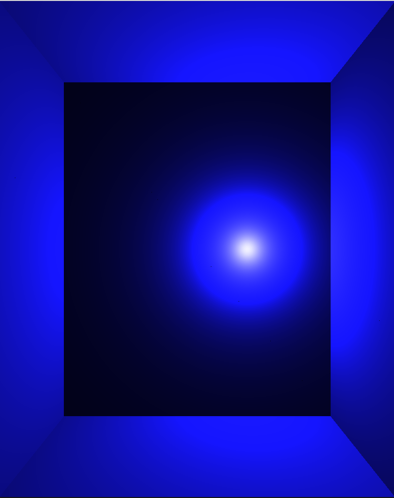

A basic photon ray tracer written in C. Will eventually use Photon Mapping to accurately display caustics. Some example images that it currently can display can be seen below!

A basic box with a light source:

A sphere intersecting a box:

A blue box:

